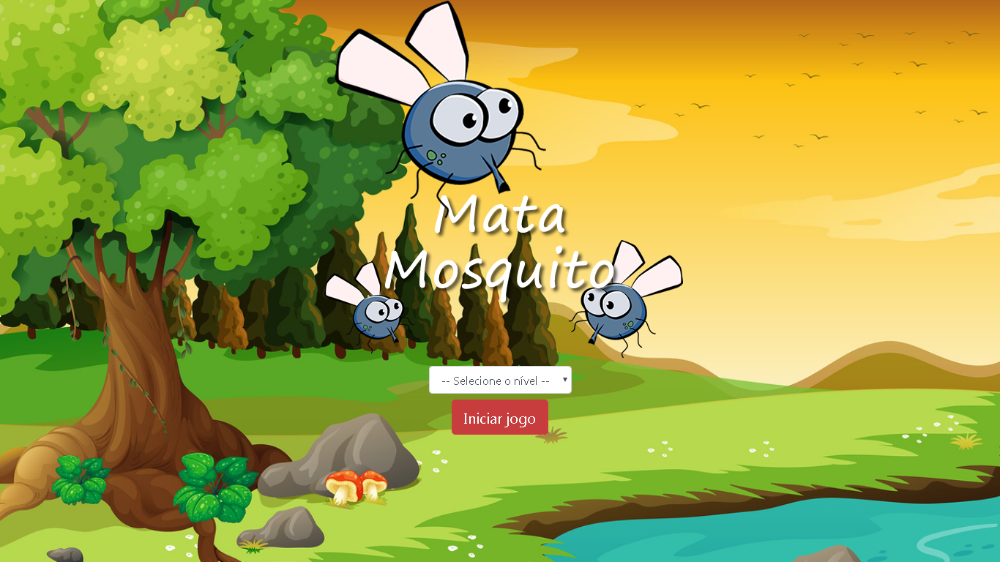

<h1 align="center">
  mata-mosquito-js 
  
</h1>

Esse é um jogo simples de matar mosquitos, que desenvolvi utilizando somente HTML, CSS e JavaScript, com o objetivo de práticar JavaScript e testar meus conhecimentos na linguagem.
